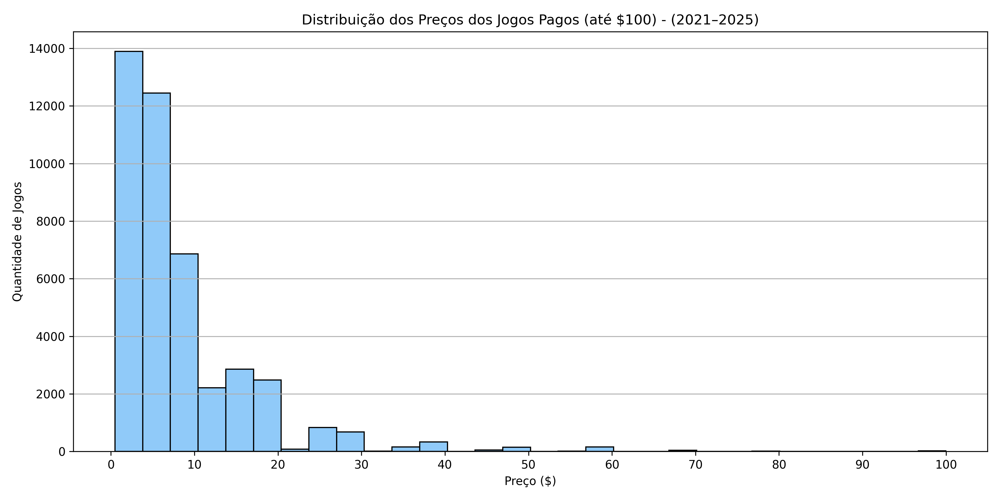
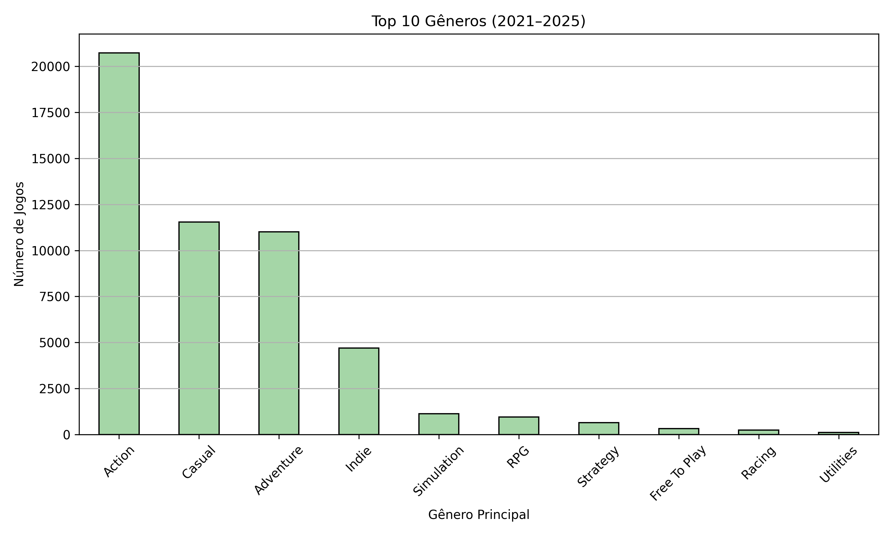
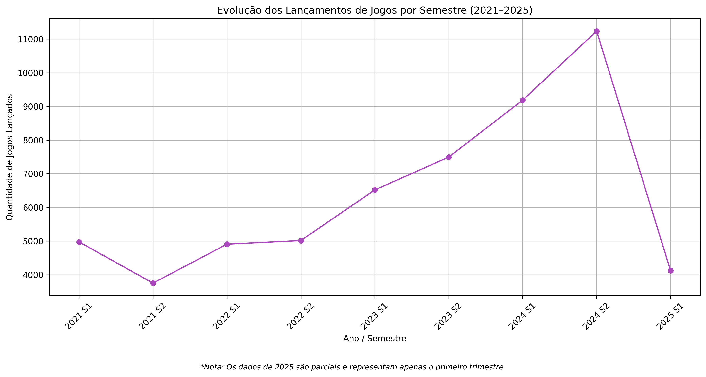

# 🎮 Análise de Dados de Jogos Steam (2021-2025)

Este projeto tem como objetivo analisar os jogos da Steam lançados entre 2021 e 2025, utilizando técnicas de análise exploratória de dados e visualização.

## 📚 Fonte de Dados

O dataset utilizado foi retirado do Kaggle:

🔗 [Steam Games Dataset (March 2025) - Kaggle](https://www.kaggle.com/datasets/artermiloff/steam-games-dataset?select=games_march2025_full.csv)

**Observação:**  
Devido às limitações do GitHub (tamanho máximo de arquivos de 100MB), o arquivo `.csv` não está disponível diretamente no repositório.  
Para reproduzir o projeto:
1. Faça o download do dataset no Kaggle.
2. Salve o arquivo em uma pasta chamada `/dataset/` na raiz do projeto.

## 🛠️ Tecnologias utilizadas

- Python 3.x
- Pandas
- Matplotlib
- PyArrow

## 📈 Estrutura do Projeto

```bash
├── analises/        # Gráficos gerados no projeto
├── dataset/         # (Ignorado no Git) - Onde colocar o CSV baixado
├── notebooks/       # Notebooks de limpeza e análise
├── README.md
├── requirements.txt
├── .gitignore
```

## 📊 Gráficos Gerados

### Top 10 Jogos Mais Avaliados (2021-2025)


Insight:
Os jogos mais avaliados no Steam entre 2021 e 2025 incluem grandes lançamentos como Elden Ring e Baldur's Gate 3. Isso indica que títulos AAA continuam dominando o engajamento da comunidade, mas também há espaço para indies de sucesso como Lethal Company.

### Distribuição dos Preços dos Jogos Pagos (até $100) - (2021–2025)



Insight:
A maioria dos jogos pagos tem preços concentrados entre $0 a $20, revelando uma estratégia de mercado focada em acessibilidade. Jogos mais caros (acima de $60) representam uma parcela muito pequena dos lançamentos.

### Top 10 Gêneros (2021–2025)



Insight:
O gênero Action domina a quantidade de lançamentos no Steam, seguido de perto por Casual e Adventure. Isso mostra a preferência por jogos dinâmicos e de rápida imersão para o público da plataforma.

### Evolução dos Lançamentos de Jogos por Semestre (2021–2025)



Insight:
Observou-se um crescimento contínuo de lançamentos até o segundo semestre de 2024. A queda em 2025 é explicada pelo fato de os dados disponíveis se referirem apenas ao primeiro trimestre.

# 🔮 Próximos passos

Novos questionamentos que irei investigar nos próximos dias:
1. Existe correlação entre o preço dos jogos e a quantidade de avaliações recebidas?
2. Quais gêneros de jogos têm as maiores médias de avaliações positivas?
3. Existe uma sazonalidade no lançamento de jogos? Qual o mês com mais lançamentos?