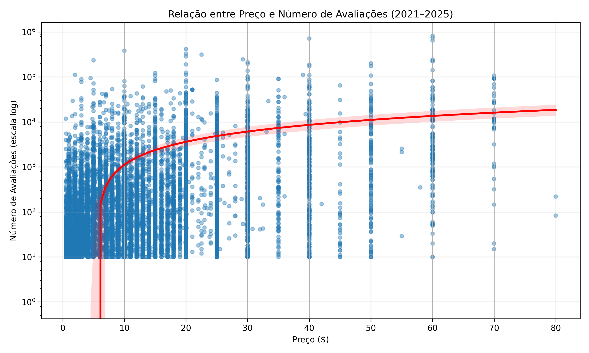
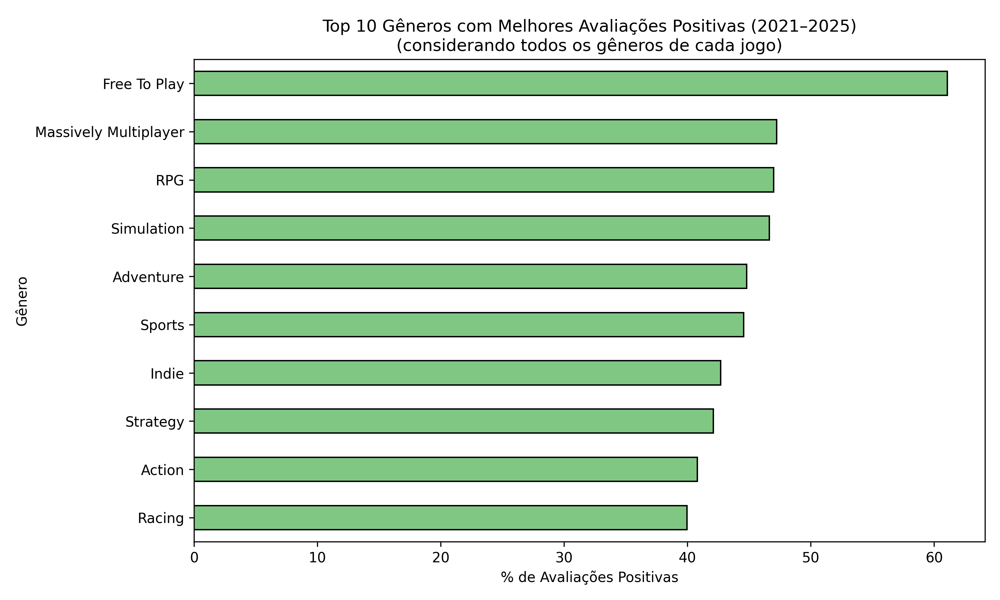
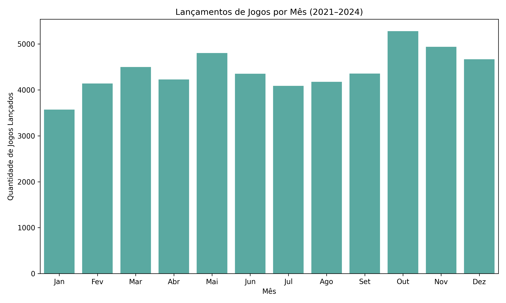

# 🎮 Análise de Dados de Jogos Steam (2021-2025)

Este projeto tem como objetivo analisar os jogos da Steam lançados entre 2021 e 2025, utilizando técnicas de análise exploratória de dados e visualização.

🔗 [Visualize aqui os gráficos dinâmicos utilizando o Streamlit](https://lua-datasetsteam.streamlit.app/)

## 📚 Fonte de Dados

O dataset utilizado foi retirado do Kaggle:

🔗 [Steam Games Dataset (March 2025) - Kaggle](https://www.kaggle.com/datasets/artermiloff/steam-games-dataset?select=games_march2025_full.csv)

**Observação:**  
Devido às limitações do GitHub (tamanho máximo de arquivos de 100MB), o arquivo `.csv` não está disponível diretamente no repositório.  
Para reproduzir o projeto:
1. Faça o download do dataset no Kaggle.
2. Salve o arquivo em uma pasta chamada `/dataset/` na raiz do projeto.

## 🛠️ Tecnologias utilizadas

- Python 3.x – Linguagem principal usada na análise e construção do projeto.
- Pandas – Manipulação e limpeza de dados tabulares.
- Matplotlib – Criação de gráficos estáticos e visualizações personalizadas.
- Seaborn – Visualizações estatísticas com foco em análise exploratória.
- Scipy – Cálculo de correlação estatística (Pearson).
- PyArrow – Leitura e escrita de arquivos Parquet de forma eficiente.
- Streamlit – Construção da aplicação web interativa para visualização dos dados.

## 📈 Estrutura do Projeto

```bash
├── analises/        # Gráficos gerados no projeto
├── dataset/         # (Ignorado no Git) - Onde colocar o CSV baixado
├── notebooks/       # Notebooks de limpeza e análise
├── README.md
├── requirements.txt
├── app.py        	 # Aplicativo do Streamlit
├── .gitignore
```

## 📊 Gráficos Gerados

### 1 - Top 10 Jogos Mais Avaliados (2021-2025)


Insight:
Os jogos mais avaliados no Steam entre 2021 e 2025 incluem grandes lançamentos como Elden Ring e Baldur's Gate 3. Isso indica que títulos AAA continuam dominando o engajamento da comunidade, mas também há espaço para indies de sucesso como Lethal Company.

### 2 - Distribuição dos Preços dos Jogos Pagos (até $100) - (2021–2025)


Insight:
A maioria dos jogos pagos tem preços concentrados entre $0 a $20, revelando uma estratégia de mercado focada em acessibilidade. Jogos mais caros (acima de $60) representam uma parcela muito pequena dos lançamentos.

### 3 - Top 10 Gêneros (2021–2025)


Insight:
O gênero Action domina a quantidade de lançamentos no Steam, seguido de perto por Casual e Adventure. Isso mostra a preferência por jogos dinâmicos e de rápida imersão para o público da plataforma.

### 4 - Evolução dos Lançamentos de Jogos por Semestre (2021–2025)


Insight:
Observou-se um crescimento contínuo de lançamentos até o segundo semestre de 2024. A queda em 2025 é explicada pelo fato de os dados disponíveis se referirem apenas ao primeiro trimestre.


## 📊 Questionamentos

### 1 - Existe correlação entre o preço dos jogos e a quantidade de avaliações recebidas?



Insight:
A correlação de 0.18 indica uma relação levemente positiva, porém muito fraca entre preço e número de avaliações. Ou seja, jogos mais caros não garantem mais engajamento. Fatores como gênero, marketing, comunidade e popularidade parecem exercer maior influência na quantidade de avaliações recebidas


### 2 - Quais gêneros de jogos têm as maiores médias de avaliações positivas?



Insight:
Gêneros como Free To Play e Massively Multiplayer têm as melhores médias de avaliações positivas. A gratuidade e a interação social parecem influenciar positivamente a percepção dos jogadores.

### 3 - Existe uma sazonalidade no lançamento de jogos? Qual o mês com mais lançamentos?



Insight:
Outubro e novembro concentram os maiores volumes de lançamentos, impulsionados por estratégias de mercado como Black Friday, festas de fim de ano e elegibilidade para premiações. Esse padrão reflete um comportamento recorrente da indústria para maximizar vendas e visibilidade.

## 📊 Conclusão

Este projeto teve como foco explorar dados da Steam entre 2021 e 2025, aplicando técnicas de análise exploratória para entender padrões de lançamentos, comportamento dos jogadores e tendências de mercado.
Além de exercitar habilidades em Python, limpeza de dados, visualização com Matplotlib e Streamlit, os resultados obtidos mostram como é possível gerar valor prático a partir de dados públicos.

A estrutura atual serve como base para futuras melhorias, como aplicação de modelos preditivos, clusterização de gêneros ou análises específicas por região. Este é um projeto em constante evolução e aberto para contribuições e ideias.


## 🔮 Ideias Futuras

Algumas possibilidades para evolução deste projeto incluem:

1. Análise de tendências por desenvolvedora ou publicadora.
2. Aplicação de modelos de regressão para prever avaliações com base em preço, gênero e tempo de jogo.
3. Visualizações mais avançadas de sazonalidade por ano individual.
4. Segmentação por idiomas e suporte a regiões.
5. Clusterização de jogos por perfil (preço, popularidade, avaliações).
6. Integração com APIs da Steam para dados em tempo real.